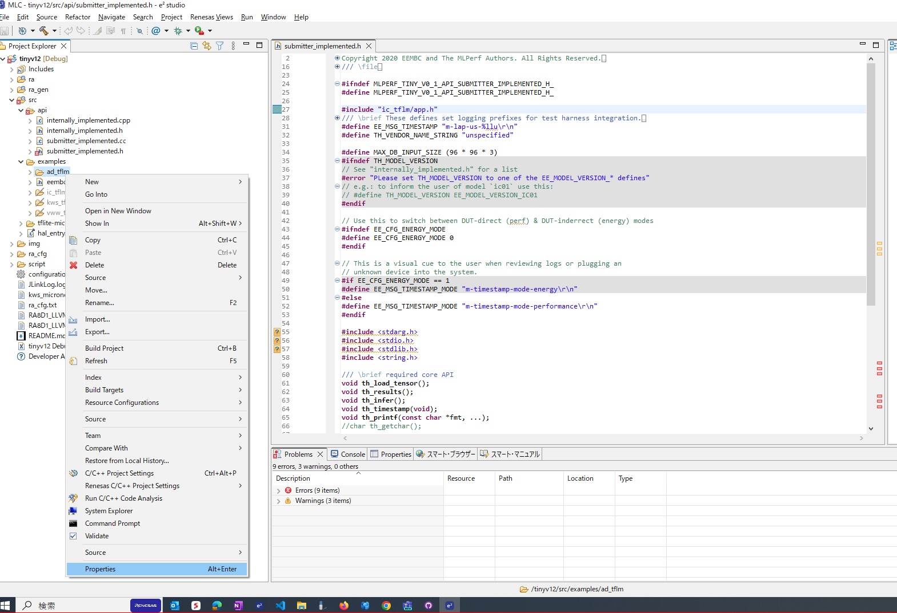
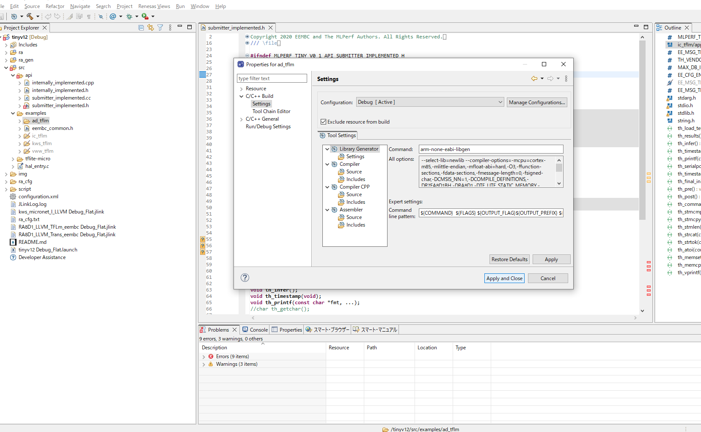
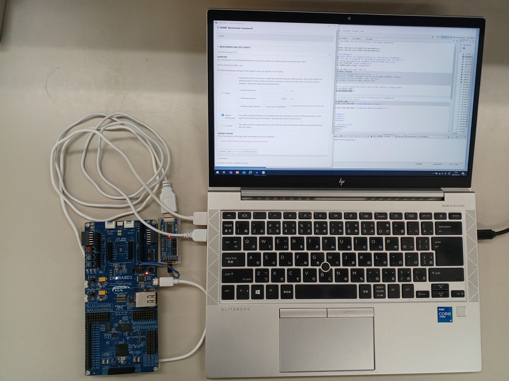

# Table of Contents
- [Table of Contents](#table-of-contents)
- [Overview](#overview)
- [Prerequisites](#prerequisites)
  - [Software](#software)
  - [Hardware (Renesas Products)](#hardware-renesas-products)
  - [Hardware (For Measurement)](#hardware-for-measurement)
- [Getting started with the benchmark projects](#getting-started-with-the-benchmark-projects)
  - [Import benchmark projects](#import-benchmark-projects)
  - [Build the project](#build-the-project)
- [Performance/Accuracy mode measurement](#performanceaccuracy-mode-measurement)

# Overview

This is the directory for `Renesas TinyMLPerf Benchmarks v1.2 Closed Division`.
There is project for [EK-RA8D1](https://www.renesas.com/EK-RA8D1) .
You can switch from model to model by compiler flags so only single project need to be imported into IDE.
Also you can change measurement modes, `Performance Mode` and `Accuracy Mode` by editing a header file.
Further details will be provided hereafter.

# Prerequisites

To build & run the projects, you need SW/HW listed below.

## Software

- [Renesas e<sup>2</sup> studio IDE](https://www.renesas.com/jp/ja/software-tool/e-studio)
- LLVM Embedded Toolchain for Arm ( installed with e2e)
- [EEMBC EnergyRunner<sup>TM</sup>: 3.0.10](https://github.com/eembc/energyrunner)

## Hardware (Renesas Products)

- [EK-RA8D1](https://www.renesas.com/EK-RA8D1)


## [Hardware (For Measurement)](https://github.com/eembc/energyrunner#bill-of-materials)


| Component | Product | Links |
| --------- | ------------------- | ---- |
| Energy Monitor     |  |  |
| Hookup Wires | Jumper Wires Premium 6" Mixed Pack of 100 | [sparkfun](https://www.sparkfun.com/products/9194) |
| USB to TTL Serial Converter | FT232RL | [Amazon](https://www.amazon.com/HiLetgo-FT232RL-Converter-Adapter-Breakout/dp/B00IJXZQ7C/ref=sr_1_1_sspa?keywords=ft232rl&qid=1646051566&sr=8-1-spons&psc=1&spLa=ZW5jcnlwdGVkUXVhbGlmaWVyPUFDS1NaUVU0MVBPMlUmZW5jcnlwdGVkSWQ9QTAxMTk4MjEzUVhNUTJLU0VKMVYzJmVuY3J5cHRlZEFkSWQ9QTAyMzYyODYxMFQ5WjFWWENXSFRZJndpZGdldE5hbWU9c3BfYXRmJmFjdGlvbj1jbGlja1JlZGlyZWN0JmRvTm90TG9nQ2xpY2s9dHJ1ZQ==) |
# Getting started with the benchmark projects

## Import benchmark projects

1. Make sure you have installed SW described above.

2. Clone or simply donwload this repo.

```
git clone https://github.com/mlcommons/submissions_tiny_1.2.git
```

3. Open e<sup>2</sup> studio.
4. Go to `File` -> `Import` -> `General` -> `Rename & Import Existing C/C++ Project into Workspace`.
5. Specify any Project name you like.
6. Click on `Browse` and select submissions_tiny_1.2/closed/renesas/EK-RA8D1.
7. Click on your project, and `Finish`.

## Build the project

1. In e<sup>2</sup> studio, right click on the project you want to build in Project Explorer tab.
2. Right click on the project in Project Explorer tab and click on `Build Project`.

# Performance/Accuracy mode measurement

1. Open submissions_tiny_1.2/closed/renesas/code/`EK-RA8D1`/src/api/submitter_implemented.h
2. Modify include file per benchmark as follows and `Save`, 

   in AD measurment #include "ad_tflm/app.h"  
   in IC #include "ic_tflm/app.h"  
   in kws #include  "kws_tflm/app.h"  
   in vww #include  "vww_tflm/app.h"  
3. Include/Exclude folders per benchamrk.     
  3.1 Chose folder and open `Properties` shown by right-click menu.  
  
     


     3.2 Check-in/Check-out to include/exclude the folder at Settings window.   
       


    


3. Build the project as mentioned in [Build the project](#Build-the-project).
4. Flash and run the binary.
5. To enable the MCU to communicate with your host machine, prepare USB to TTL Serial Converter and connect them through RX and TX ports shown in the image below.


    


6. Start measurement with EEMBC Energy Runner.

