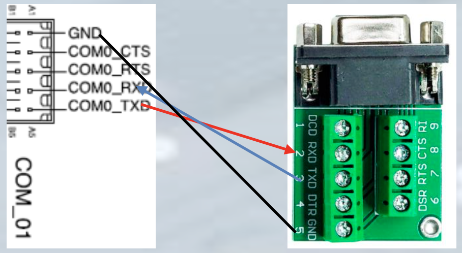
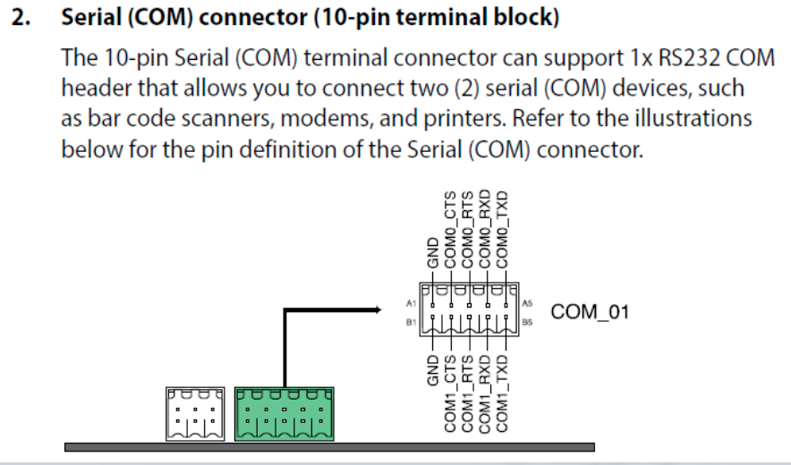
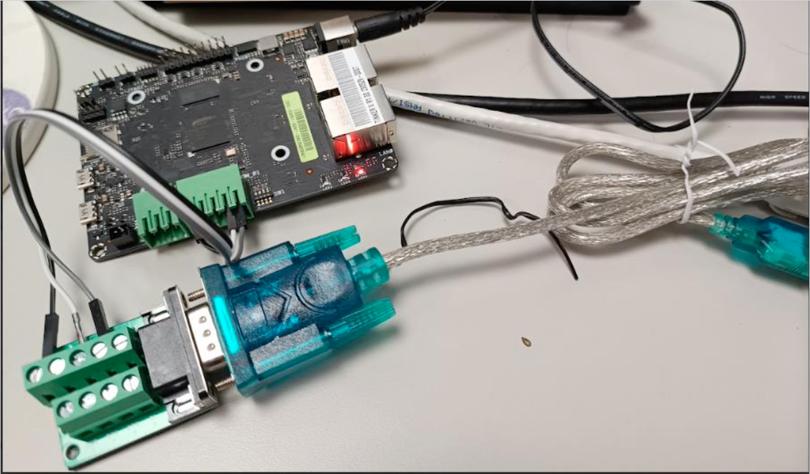

# MLPerf™ Tiny Benchmarking with ONNC
Tiny ONNC is a user-friendly AI toolchain designed for deploying neural network models onto embedded system. It accomplishes this by generating a sequence of function calls that leverage neural network libraries. This submission specifically focuses on RISC-V AndesCore processor, utilizing the ANDES-NN library as the neural network library of choice. The ANDES-NN library offers integer version of computation for widely used neural network operators. To ensure an optimal model accuracy, Tiny ONNC has developed a post-training quantization (PTQ) engine that aligns with the quantization scheme employed by the library.

The compiled result has been successfully ported to Linux. This guide provides step-by-step instructions to reproduce the results presented in this submission. Please note that the instructions provided have been tested on Ubuntu 20.04 Desktop.

This benchmark suggests this board: [Tinker V](https://tinker-board.asus.com/series/tinker-v.html).

# Linux on Tinker-V
## Environment setup
```
WS=`pwd`
# set nds compiler
# wget https://github.com/andestech/Andes-Development-Kit/releases/download/ast-v5_2_1-release-linux/nds64le-linux-glibc-v5d.txz
tar xJvf nds64le-linux-glibc-v5d.txz
cd nds64le-linux-glibc-v5d/bin
export CC=`pwd`/riscv64-linux-gcc
export CXX=`pwd`/riscv64-linux-g++
export STATIC_LINK=True
# set andes_nn path
export ANDES_PATH=${WS}/andes_nn
```
## Build image
```
BENCHMARK=${WS}/TinkerV-linux-andes_nn/<MODEL>
cd ${BENCHMARK}
bash build.sh
```
Where MODEL is one of {ad, ic}.
The ONNC's generated code can be found in the `<MODEL>01_code` folder. You can generate it according to `prepare/` folder

## Deploy image to board
0. Follow this page to prepare linux
 - https://github.com/TinkerBoard/TinkerBoard/wiki/Tinker-V#1-build-image
1. Using Power Adapter with Tinker-V
 - Input 10V-24V DC
 - 5.5/2.5 header type
 - Max Power consumption about 7Watt
 - Suggest to use 12V/1A PSU


2. Connect your Tinker-V to your computer by using `DB9 converter` and `USB to RS232 converter`.




3. Use minicom to send `${WS}/TinkerV-linux-andes_nn/<MODEL>/build/app` to to board.
 - Serial port setting : 115200 8N1
 - Login : Root
 - Password: None
```
# device may at /dev/ttyUSB0
sudo minicom
# key Ctrl+A
# key s
# choose zmodem
# choose Okay
# give path of ${WS}/TinkerV-linux-andes_nn/<MODEL>/build/app
```
4. execute ./app and then exit minicom
```
./app
# key Crtl+X to exit
```

Now your board is ready for benchmarking.

# Benchmark by using energy runner
You can [download energy runner](https://www.eembc.org/energyrunner/mlperftiny/) mentioned from [its repo](https://github.com/eembc/energyrunner), and extract it

```bash
mkdir ${WS}/EnergyRunner_MLPerfTiny
mv EnergyRunner_MLPerfTiny_Linux.tar.gz ${WS}/EnergyRunner_MLPerfTiny
cd ${WS}/EnergyRunner_MLPerfTiny
tar zxvf EnergyRunner_MLPerfTiny_Linux.tar.gz
```

The EnergyRunner reads the dataset from `$USER/eembc/runner/benchmarks/ulp-mlperf/datasets/`, so you will need to copy the test dataset to this location.

You can find the test data in the datasets directory of the [EnergyRunner repository](https://github.com/eembc/energyrunner/tree/main/datasets). Alternatively, you can generate the test data using the [provided source scripts](https://github.com/mlcommons/tiny/tree/master/benchmark/training).

```
sudo mkdir -p /root/eembc/runner/benchmarks/ulp-mlperf/datasets/
# Copy test data to /root/eembc/runner/benchmarks/ulp-mlperf/datasets/
```

Then start the energy runner
```
sudo ${WS}/EnergyRunner_MLPerfTiny/benchmark-framework --no-sandbox
```
## 1. Get performance
1. choose `ML Performance 1.0.1`
2. click `Setup`
3. set `Inference Iterations`, recommand value is
    - ad01: 30000
    - ic01: 400
4. click `Median Performance`
5. click `Initialize`
6. click `Run`

Then, you will be able to view the performance metrics in the console located below.
```
00025.209 ulp-mlperf:   Runtime      :       xxx sec.
00025.209 ulp-mlperf:   Throughput   :       xxx inf./sec.
```
## 2. Get precision
1. choose `ML Performance 1.0.1`
2. choose `Accuracy`
3. click `Initialize`
4. click `Run`

Then, you will be able to view the accuracy metrics in the console located below.
```
00405.539 ulp-mlperf: Top-1: xxx%
00405.566 ulp-mlperf: AUC: xxx
```